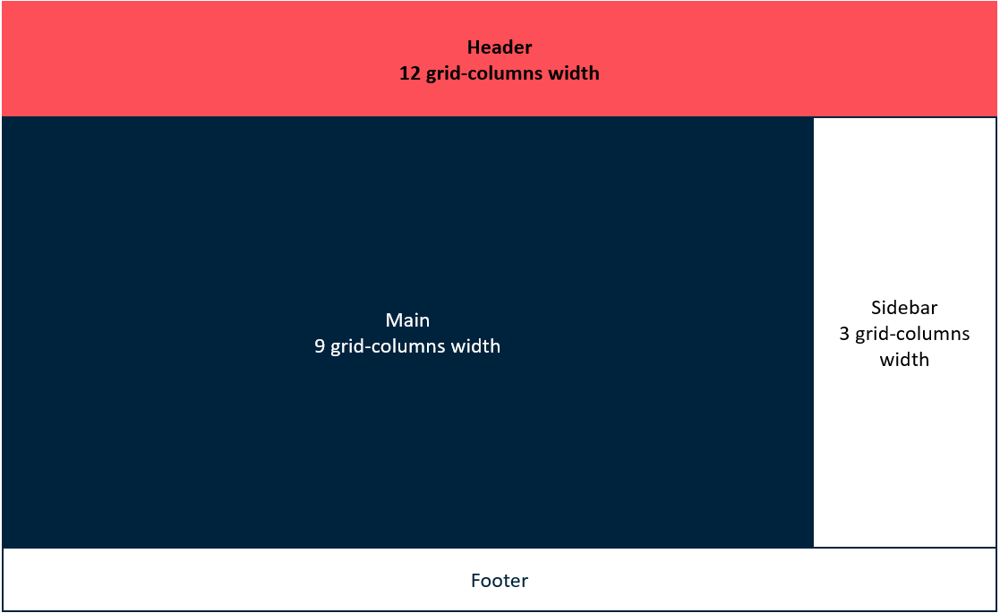
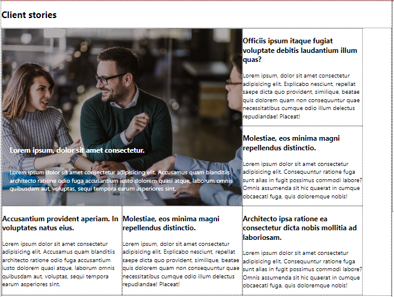
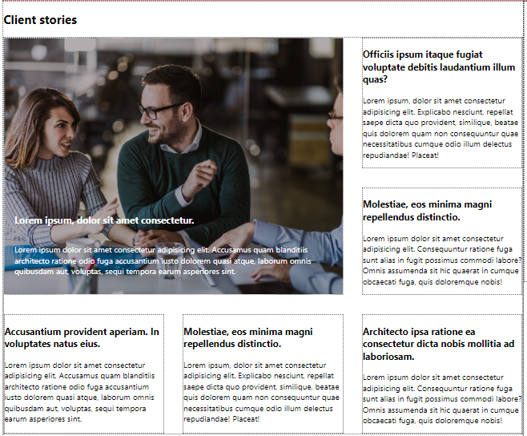
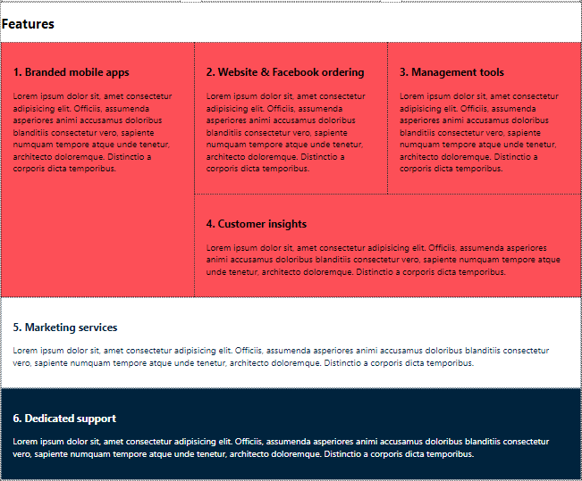
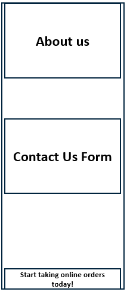

# CSS Grid

## Before we start

1. This practical task is verified automatically with tests. 
2. Please, put all your `CSS` code to the `src/style.css` file. If you use any other file, we would not be able to verify it.
3. Please, don't change the page structure, it may affect tests.

## Development

While you developing, you can simply open `src/index.html` in a browser for checking it. However, we prepared a more convenient way to run it locally, you can find all the details here - [Local Development](./docs/LocalDevelopment.md).

## Check your solution before submitting it (OPTIONAL)

To be sure you submit a correct solution, you can verify it locally. It requires some local setup. Here you can find a description of how to do it - [Verify your solution locally](./docs/VerifySolutionLocally.md)

## Task Requirements

In this task, we ask you to change existing styles using CSS Grid features to follow the mockup.
Please, note you MUST add all CSS rules in the `src/style.css` file and not change the `src/index.html` file. We can't verify your solution if you use a different file. You don't need to add additional selectors with rulesets in `src/style.css`. Please, add required properties in existing rulesets.

### Add proper CSS Grid rules to required html elements to match mockups

   #### Create page skeleton with grid
   - Add `grid-template-columns` property to `body` to make it 12-columns grid, where each column is 1 fraction width. Use `repeat` function.
   - Add `grid-template-rows` property to `body` to divide layout into 3 rows. Rows height should be `auto`. Use `repeat` function.
   - Add named `grid-area` to: `header`, `footer`, `main` and `aside`. Grid area names should be `header, footer, main, sidebar`.
   - Add `grid-template-areas` property to `body` to place grid items according to schema. Pay attantion that you should use given grid area names.

   

   #### Style "Client Stories" section
   - Make `div` in `.client_stories` to display as a 3-columns grid. Each column should have width 320px. Use `repeat` function.
   - Place first grid item in Client Stories section to match mockup below. Apply `grid-column-start`, `grid-column-end`, `grid-row-start`, `grid-row-end` properties.
    
   

   - In `.client_stories > div` selector add use `gap` or `grid-gap` property to add spaces between rows ONLY. Space size should be `calc(var(--space-size)*2)`.
   - Align grid items in `.client_stories > div` selector to reduce extra space at the right.

   What you have now:

   

   What you should have after proper grid-items alignment:

   

   #### Style "Features" section
   - Make `div` in `.features` section to display as a 3-columns grid without any spaces between columns and rows. Use proper units to define colunms width: columns should grow and shrink according to the available space. All columns should have the same width. Use `repeat` function.
   - Order grid items in Features section properly.
   - Place grid items in Features section according to mockup. Apply `grid-column-start`, `grid-column-end`, `grid-row-start`, `grid-row-end` properties for proper selectors.

   

   #### Style sidebar
   - Align items in sidebar according to schema below

   

  #### Combine CSS Grid and CSS Flexbox layout
  - Make first grid item of Client Stories section flexible.
  - Align content in created flex container to match provided design

  

